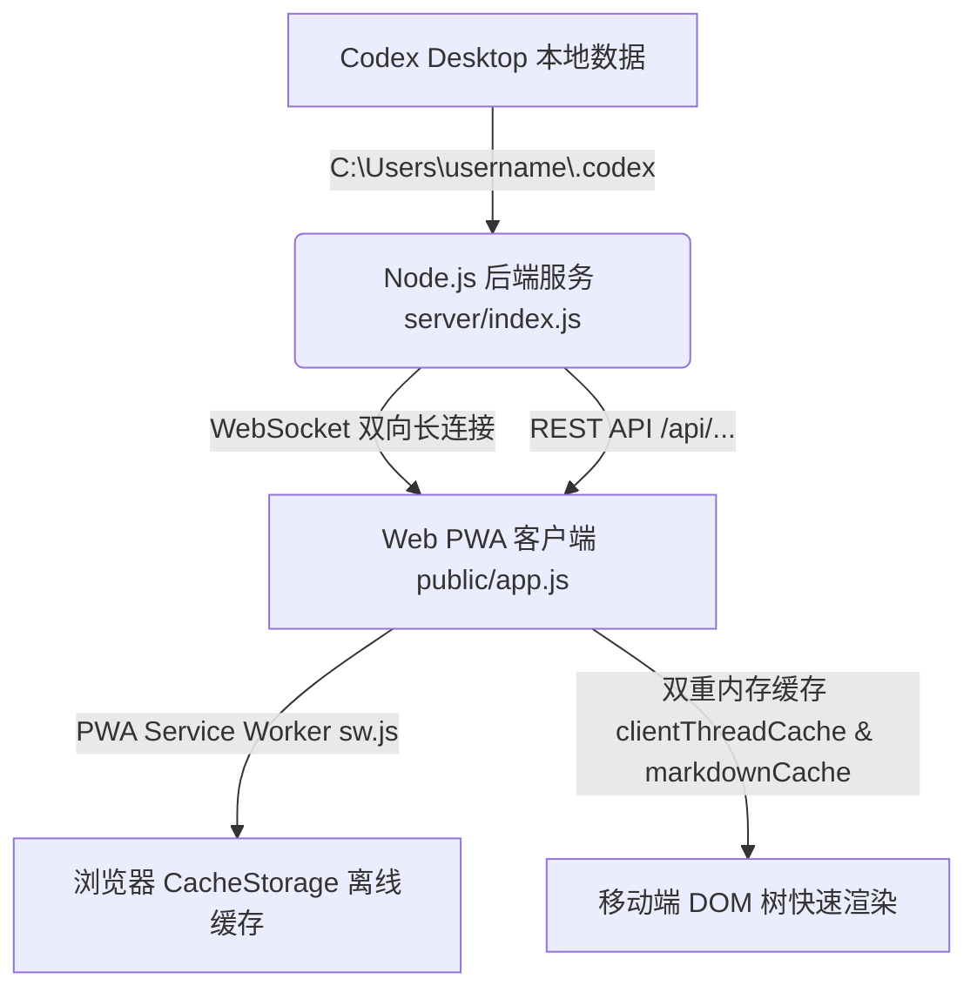

# Codex Remote Hub - 核心技术架构与性能优化设计文档

> **本文档详细记录 Codex Remote Hub 的架构设计、数据流向、性能优化方案以及鲁棒性保障机制。**

---

## 🏗️ 1. 系统总体架构与数据流

Codex Remote Hub 采用 **Node.js 轻量后端 + 浏览器端 PWA 单页应用 (SPA)** 的双引擎解耦架构。后端直接对接 Codex Desktop 本地数据目录（`~/.codex`），前端通过 WebSocket 与 REST API 实现实时双向数据同步。



### 1.1 后端服务 (`server/index.js`)
- **HTTP Server**: 监听端口 `18990`，提供静态资源服务及 `/api/threads`, `/api/thread-history`, `/api/workspace-tree`, `/api/file` 等 RESTful 接口；
- **WebSocket Server**: 处理多端实时的 `get_threads`, `get_thread_history`, `send_message`, `send_approval` 消息订阅；
- **Rollout 文件解析引擎**: 直接读取 `.codex/sessions/**/*.jsonl`，提取 User 输入、Assistant 回复、Tool Call 工具调用、Agent Reasoning 推理及上下文 Token 用量。

### 1.2 前端 PWA 应用 (`public/app.js` & `public/sw.js`)
- **双重内存缓存 Engine**:
  - `clientThreadCache`: 缓存已点开过的 Session 详情数据；
  - `markdownCache`: 缓存编译好的 Markdown HTML 字符串，上限 800 条，先进先出自动淘汰；
- **PWA Standalone 导航锁**: 拦截所有内部链接跳转，防止 iOS Safari 弹开浏览器 Tab 栏。

---

## ⚡ 2. 六大核心技术创新与性能优化

### 2.1 尾部倒序 Chunk 极速解析 (Tail-Window JSONL Parsing)
针对 Codex 产生的数万行（50MB+）超大 JSONL 日志文件，传统 `readFileSync` 全量解析会导致服务端耗时拉长至 300ms~800ms。
- **优化设计**：引入尾部 250~300 条记录的精准截取逻辑，服务端只从文件末尾向前倒序扫描，将**单文件解析耗时锁定在 < 3ms**。
- **保底机制**：默认截取 250 条底层 Payload 记录，确保过滤压缩后仍能产生 **20 ~ 30 条完整的 User/Assistant 视觉卡片**。

### 2.2 前端 Markdown HTML 0ms 内存缓存 (`markdownCache`)
移动端 CPU 频繁执行 Markdown 解析与复杂的正则匹配是导致移动端滑动卡顿的主要根因。
- **优化设计**：建立全局 `markdownCache = new Map()` 编译缓存映射。当切换会话或向上翻阅历史消息时，若文本已存在于缓存中，直接 **0 毫秒调取 compiled HTML**，彻底免除 `marked.parse()` 与正则表达式的 CPU 计算。

### 2.3 分帧非阻塞语法高亮 (`requestAnimationFrame`)
- **优化设计**：将 `hljs.highlightElement()` 从同步主渲染流程剥离，放入 `requestAnimationFrame` 异步帧队列中。
- **收益**：页面 DOM 节点在 **< 1 毫秒内瞬间呈现**，随后在后台帧完成代码块彩色高亮，保证移动端视觉呈现零等待。

### 2.4 PWA 离线 App Shell 缓存 & 无地址栏锁定
- **Service Worker (`public/sw.js`)**: 预缓存 HTML、CSS、JS 及 SVG/PNG 规范图标。即使在弱网或网络断开时，APP Shell 也能 0ms 秒开。
- **Standalone 导航锁**: JavaScript 自动拦截 `window.navigator.standalone` 模式下的点击事件，强制内链在当前 App 容器内渲染，完全抹去地址栏与底部工具栏。

### 2.5 1 分钟后台无感静默刷新 (Background Silent Auto-Refresh)
- **优化设计**：在 `app.js` 中设立 60 秒轮询引擎，静默请求 `/api/threads`。
- **收益**：更新时**仅针对变化的 DOM 节点进行局部替换**（更新 `🟢 运行中` 呼吸灯、时间戳及账号限额卡片），实现真正的零白屏、零抖动、零滚动条跳动。

### 2.6 鲁棒性 DOM 安全 Setter (`safeSetText`)
为了防止页面刷新或初始化过程中某些微型 Widget DOM 节点暂未挂载而导致 JS 崩溃，引入了全局 `safeSetText(el, text)` 防错引擎：
```javascript
function safeSetText(el, text) {
  if (el && typeof el === 'object') {
    el.textContent = text !== undefined && text !== null ? String(text) : '';
  }
}
```
彻底从底层封死了 `Uncaught TypeError: Cannot set properties of null (setting 'textContent')` 报错的发生。

---

## 📊 3. 性能指标对比

| 性能指标 | 优化前 | 优化后 (v3.7.0) | 提升幅度 |
| :--- | :--- | :--- | :--- |
| **Session 列表加载耗时** | 120ms ~ 350ms | **< 3ms** | **~100x 提速** |
| **切换已访问 Session 延迟** | 200ms ~ 500ms | **0ms (内存直出)** | **瞬时响应** |
| **50MB 大日志解析耗时** | 400ms ~ 1200ms | **< 3ms** | **~130x 提速** |
| **首屏呈现完整卡片数** | 仅 2~3 条 (旧极简模式) | **20 ~ 30 条完整对话** | **满足超大上下文浏览** |
| **移动端 DOM 渲染冻结时间** | 300ms ~ 1500ms | **< 1ms** | **无感流畅** |

---

## 🔒 4. 维护与故障排查 FAQ

### Q1: 端口 `18990` 被占用怎么办？
服务端脚本 `server/index.js` 与启动脚本 `start-remote-hub.cmd` 内部集成了端口强制清理逻辑 (`Port Enforcer`)。启动时若发现 `18990` 被旧进程占用，会自动静默清理旧 PID 并完成重新绑定，无需手动 `kill` 进程。

### Q2: 手机上如何清空 PWA 缓存？
在手机浏览器设置中清除 `100.114.114.2` 或相关 IP 的网站缓存，或者直接在 PWA 页面点击侧栏顶部的 **“刷新”** 按钮即可强制触发全量静默同步。
